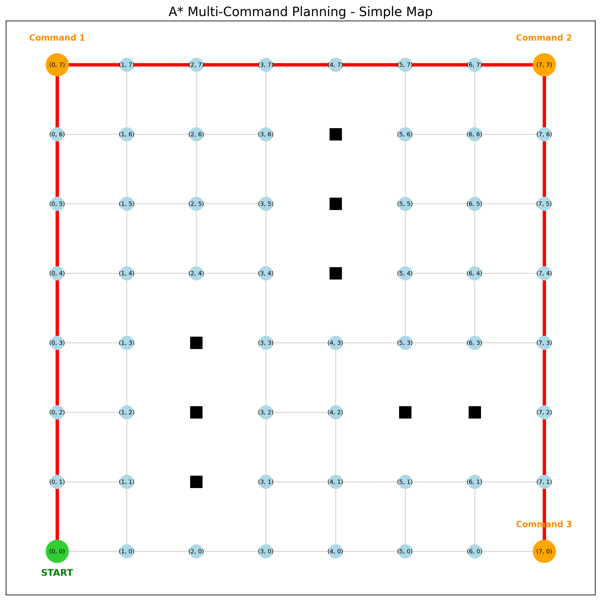
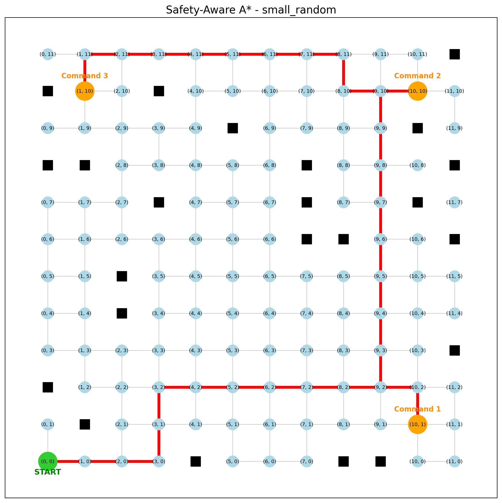
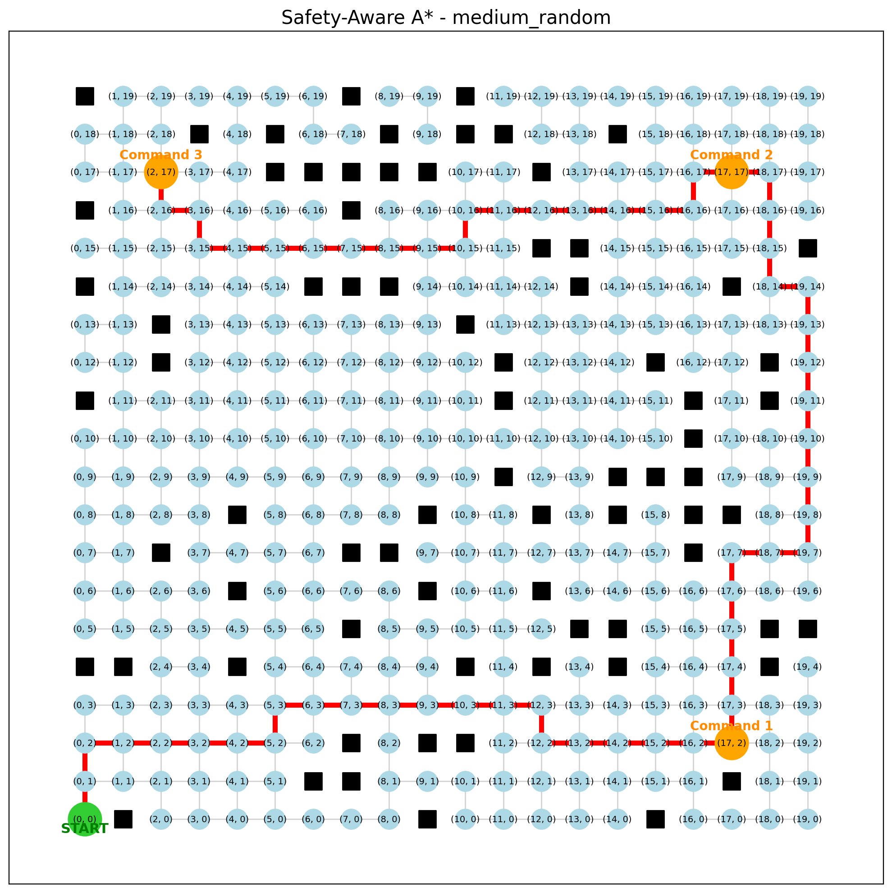
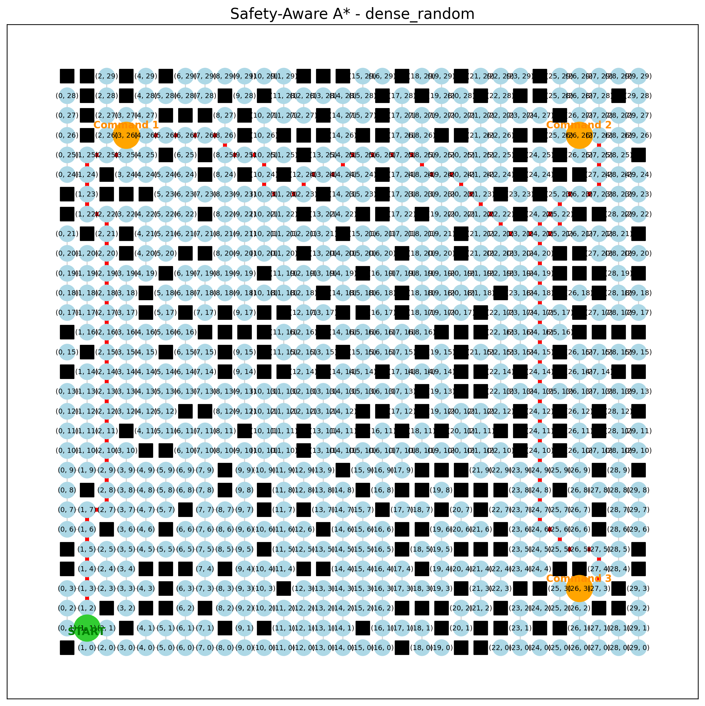
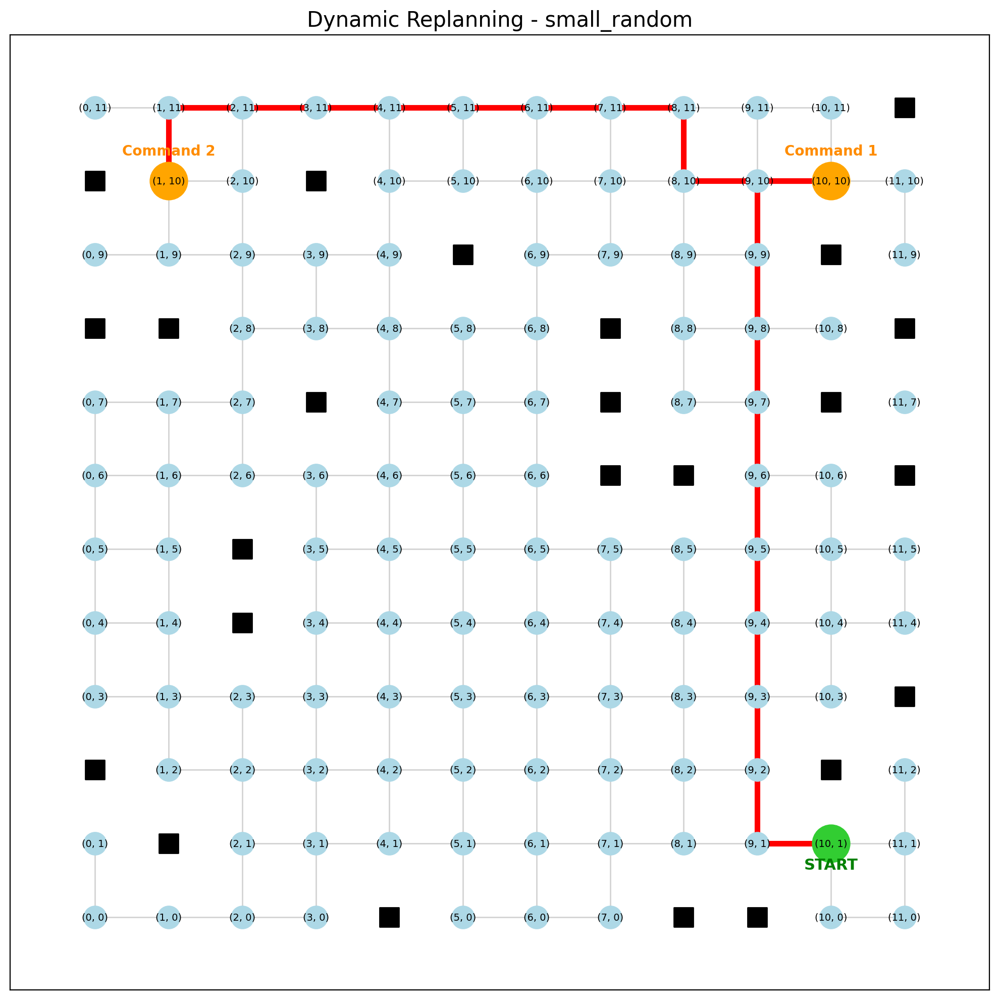

# GPSR Multi-Command Path Planning

A Python prototype for planning robot routes when several navigation commands arrive at the same time.

**Question:** In what order should the robot visit the command destinations to minimize the total path cost?

The implementation combines **A\*** point-to-point planning with **exhaustive command-order evaluation**. It also explores random maps, obstacle-clearance costs, corridor compression, and replanning after a simulated new obstacle.

> This is a graph-based planning prototype. It does not yet control a robot or integrate with ROS 2 / Nav2.

## 1. Basic Idea

For three commands, there are `3! = 6` possible execution orders:

| Order | Route |
| --- | --- |
| 1 | Start → A → B → C |
| 2 | Start → A → C → B |
| 3 | Start → B → A → C |
| 4 | Start → B → C → A |
| 5 | Start → C → A → B |
| 6 | Start → C → B → A |

For example, the cost of the first order is:

```text
cost(Start, A) + cost(A, B) + cost(B, C)
```

The planner first computes A* paths between relevant locations and caches their paths and costs. It then evaluates all `n!` command orders using those cached costs, selects the minimum-cost order, and joins its path segments into a full route.

The robot starts at the given position and finishes at the last command; returning to the start is not included.

## 2. Baseline Implementation

### A* path planning

A* ranks nodes using:

```text
f(n) = g(n) + h(n)
```

- `g(n)`: accumulated edge cost from the start.
- `h(n)`: Euclidean distance from the current node to the goal.

The baseline grid uses distance-only edge costs. The advanced experiments change the graph or its edge weights while reusing the same A* implementation in [astar.py](astar.py).

### Multi-command ordering

For `n` destinations, all `n!` permutations are evaluated. The returned values include the best command order, full route, total objective cost, costs of all orderings, and a node-expansion metric.

This approach is easy to inspect for a small number of commands, but factorial growth limits scalability.

## 3. Baseline Result

The current default demo uses an **8 × 8 grid**, with eight blocked cells:

```text
Start:                 (0, 0)
Commands:              [(0, 7), (7, 7), (7, 0)]
Possible orders:       3! = 6
Selected order:        [(0, 7), (7, 7), (7, 0)]
Minimum total cost:    21.00
```

The reverse perimeter order has the same cost; the implementation retains the first minimum-cost order it encounters.



Green marks the start, orange marks command destinations, black squares mark blocked cells, and red edges show the planned route. The terminal also prints the full list of route coordinates.

## 4. Map Generalization

The same planner is used without modifying the A* implementation. The advanced scenarios vary map size, obstacle probability, and random seed:

| Scenario | Grid size | Obstacle probability | Seed |
| --- | --- | ---: | ---: |
| `small_random` | 12 × 12 | 0.15 | 42 |
| `medium_random` | 20 × 20 | 0.20 | 100 |
| `dense_random` | 30 × 30 | 0.28 | 2026 |

These are configured in [advanced/scenarios.py](advanced/scenarios.py). Obstacle probability is the generation parameter, not the exact fraction of blocked cells in the resulting map.

The following images show the **safety-aware routes** produced by the advanced demo.

### Small random map



### Medium random map



### Dense random map



## 5. Safety-Aware Path Cost

Distance-only planning minimizes:

```text
edge cost = distance
```

The experimental clearance model uses:

```text
edge clearance = min(clearance at endpoint u, clearance at endpoint v)

edge cost = distance_weight × distance
          + clearance_weight / max(edge clearance, 0.5)
```

Node clearance is the Euclidean distance to the nearest blocked grid node. The default weights are `distance_weight = 1.0` and `clearance_weight = 2.0`. If there are no obstacles, the penalty is zero.

This penalizes edges near obstacles. It is a soft preference, not a guaranteed robot safety margin or a footprint collision check.

**In the three benchmark scenarios, the minimum clearance remains 1.00 for all versions.** The penalty changes objective cost and search behaviour, but these results do not demonstrate improved minimum clearance.

## 6. Graph Reduction

[advanced/graph_reduction.py](advanced/graph_reduction.py) contracts eligible degree-2 corridor nodes and replaces their edges with an edge carrying the accumulated cost. Start and command nodes are protected.

For example, a corridor with several intermediate nodes can be represented by a single weighted edge between its endpoints. The compressed route is expanded back into the original grid nodes for distance and clearance evaluation.

The aim is to reduce the search graph while preserving route cost.

## 7. Benchmark Results

| Version | Meaning |
| --- | --- |
| `distance` | Distance-only planning |
| `safety` | Distance plus obstacle-clearance penalty |
| `compressed` | Safety-aware planning after corridor compression |

The following table records an earlier local benchmark run. Its non-timing metrics were reproduced while preparing this README. Timings are illustrative, depend on the machine and runtime, and are not averages over repeated trials.

| Scenario | Version | Nodes | Objective Cost | Distance | Clearance | Expanded Nodes | Time (ms) |
| --- | --- | ---: | ---: | ---: | ---: | ---: | ---: |
| small_random | distance | 121 | 33.00 | 33.00 | 1.00 | 65 | 1.715 |
| small_random | safety | 121 | 87.01 | 35.00 | 1.00 | 146 | 2.205 |
| small_random | compressed | 103 | 87.01 | 35.00 | 1.00 | 127 | 2.827 |
| medium_random | distance | 325 | 59.00 | 59.00 | 1.00 | 166 | 4.680 |
| medium_random | safety | 325 | 152.17 | 59.00 | 1.00 | 376 | 5.963 |
| medium_random | compressed | 260 | 152.17 | 59.00 | 1.00 | 304 | 5.747 |
| dense_random | distance | 656 | 99.00 | 99.00 | 1.00 | 464 | 6.885 |
| dense_random | safety | 656 | 282.63 | 99.00 | 1.00 | 943 | 12.547 |
| dense_random | compressed | 471 | 282.63 | 99.00 | 1.00 | 707 | 12.141 |

### How to read the metrics

- **Nodes:** number of graph nodes passed to the planner.
- **Objective Cost:** sum of the edge weights being optimized. Distance-only and safety-aware versions use different objectives, so their objective values are not a like-for-like quality comparison.
- **Distance:** geometric length of the full route in grid units.
- **Clearance:** minimum node-to-obstacle distance along the route, in grid units.
- **Expanded Nodes:** sum of A* expansions for the segments of the selected best route, including goal nodes. It is **not** the total number of expansions across every pairwise search.
- **Time:** time inside `find_best_command_order`, including pairwise planning and order evaluation. It excludes map generation, clearance-cost construction, graph compression, and plotting.

### What the results show

For `dense_random`, compression reduces graph nodes from **656 to 471** and the reported expansions from **943 to 707**, while retaining the safety-aware objective cost of **282.63**.

The same cost-preservation pattern appears in the other two scenarios. This supports the usefulness of compression on these maps, but does not establish an end-to-end speedup: preprocessing is outside the timer, and the small-map timing in the recorded run is slower after compression.

The safety-aware version does **not** improve minimum clearance in these scenarios. It remains an experimental extension.

## 8. Dynamic Replanning

The advanced demo simulates the following sequence:

1. Plan a route through all commands.
2. Assume the robot has reached the first command.
3. Introduce a new blocked node.
4. Update the graph and clearance costs.
5. Replan from the current position through the remaining commands.

For `small_random`, the reproduced example reaches `(10, 1)`, introduces an obstacle at `(10, 2)`, and replans the remaining destinations `(10, 10)` and `(1, 10)`.



The image shows the remaining route from the first completed command. This is a discrete graph experiment, not a moving-robot or sensor simulation. If the demo cannot find a suitable obstacle for the experiment, it reports that no replanning was performed.

## 9. Project Structure

| Path | Purpose |
| --- | --- |
| `astar.py` | A* search, cached pairwise paths, and command-order evaluation |
| `demo.py` | Baseline demo with simple, maze, and random maps |
| `map.py` | Baseline map generation |
| `demograph.py` | Matplotlib route visualization |
| `pp1.py` | Additional standalone script |
| `test_astar.py` | Baseline tests |
| `advanced/__init__.py` | Advanced package |
| `advanced/ad_demo.py` | Advanced demo and simulated replanning |
| `advanced/random_grid.py` | Random grid generation |
| `advanced/scenarios.py` | Scenario parameters |
| `advanced/cost_model.py` | Distance and clearance costs |
| `advanced/graph_reduction.py` | Corridor compression and route expansion |
| `advanced/dynamic_replanning.py` | Replanning after environment changes |
| `advanced/benchmark.py` | Three-version benchmark |
| `test/test_cost.py` | Cost-model tests |
| `test/test_generilization.py` | Map generalization tests (current filename) |
| `test/test_graph_reduction.py` | Compression tests |
| `test/test_replanning.py` | Replanning tests |
| `images/` | Saved results displayed in this README |

## 10. Installation

Use Python 3. The documentation examples and existing tests were checked with Python 3.12, NetworkX 3.7, Matplotlib 3.10.8, and pytest 9.1.1.

Clone the repository and enter its root directory. Access to this repository is required while it is private.

```bash
git clone https://github.com/imwwhywhy/GPSR_pathplanning.git
cd GPSR_pathplanning
python -m pip install networkx matplotlib pytest
```

A virtual environment is recommended if you work on multiple Python projects. On systems where Python 3 is named `python3`, use `python3` in place of `python`.

## 11. How to Run

Run all commands from the repository root.

### Baseline demo

```bash
python demo.py
```

This runs the simple 8 × 8 map and saves `route_simple.png`. Other baseline maps are available with `python demo.py maze` and `python demo.py random`; their output filenames are `route_maze.png` and `route_random.png`.

### Advanced scenarios

```bash
python -m advanced.ad_demo --scenario small_random
python -m advanced.ad_demo --scenario medium_random
python -m advanced.ad_demo --scenario dense_random
```

Each command compares the three planning versions and runs the dynamic replanning experiment. It saves `advanced_route_<scenario>.png` and, when replanning succeeds, `replanned_route_<scenario>.png` in the working directory.

To change the experimental clearance weight:

```bash
python -m advanced.ad_demo --scenario small_random --clearance-weight 2.0
```

Matplotlib displays plot windows; close the first window to let the demo continue to subsequent steps. For a headless Linux run, prefix the command with `MPLBACKEND=Agg`.

The files in `images/` are committed documentation snapshots. Running a demo writes its normal output filenames in the working directory; it does not automatically replace the README snapshots.

### Benchmark

```bash
python -m advanced.benchmark
```

### Tests

```bash
python -m pytest -v
```

The existing suite passed **14 tests** during README preparation. The default baseline demo, all three advanced demos, and the benchmark also completed successfully.

## 12. Current Progress and Limitations

Implemented:

- A* point-to-point path planning.
- Exhaustive multi-command ordering with cached pairwise paths.
- Multiple map sizes and seeded random obstacles.
- Experimental obstacle-clearance penalties.
- Corridor compression with path reconstruction.
- Replanning after a simulated new obstacle.
- Automated tests, route plots, and benchmarking.

Current limitations:

- Exhaustive ordering scales factorially with command count.
- Clearance is a grid-node metric; robot footprint and motion constraints are not modeled.
- Minimum-clearance improvements have not been demonstrated on these three scenarios.
- Reported timings exclude preprocessing and do not measure complete robot-navigation latency.
- The prototype has no live perception, controller, ROS 2 / Nav2, or BARN integration.

## 13. Future Work

A possible integration pipeline is:

**Occupancy grid / costmap → graph representation → A* pairwise paths → command ordering → planned route → robot controller**

Possible next steps include:

- ROS 2 / Nav2 and BARN simulation integration.
- Better clearance costs and robot-footprint handling.
- More efficient optimization for larger command sets.
- Dynamic costmap updates.
- Motion and controller integration.

The current deliverable is a reproducible Python implementation showing what was planned, which command order was selected, and how the experimental extensions affect the results.
